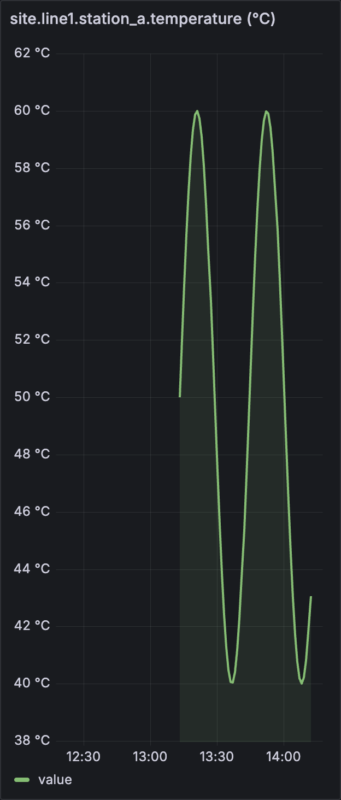

# HistorianBridge

> One typed API in front of every industrial historian. Read-only.
> Local binary. No login. v0.1.0 ships now.

[](https://github.com/er-mal/historian-bridge/releases/tag/v0.1.0)




---

## What is this? (30 seconds)

In a factory, "historian" software records sensor readings — temperature,
pressure, flow — millions of rows a day. Every vendor has a different
historian (PI, Wonderware, Influx, IP21, PHD, …) and a different API.
Anyone who wants to read the data — Grafana, a data scientist, an MES
analyst — has to write glue code per vendor.

**HistorianBridge is one HTTP API in front of all of them.** Point your
chart at HistorianBridge instead of the vendor. When you swap the
historian, your chart doesn't change.

```bash
historianbridge --seed-demo query "tag:site.line1.station_a.temperature last 1h"
```

That command, from a 22 MB binary you can download below, returns 60
typed JSON points. No installer. No service. No login.

---

## Try it in 90 seconds

### Mac (Apple Silicon)

```bash
curl -sL -o hb https://github.com/er-mal/historian-bridge/releases/download/v0.1.0/historianbridge-macos-arm64
chmod +x hb
./hb --seed-demo query "tag:site.line1.station_a.temperature last 1h"
```

### Linux (x86_64)

```bash
curl -sL -o hb https://github.com/er-mal/historian-bridge/releases/download/v0.1.0/historianbridge-linux-x86_64
chmod +x hb
./hb --seed-demo query "tag:site.line1.station_a.temperature last 1h"
```

### From PyPI / wheel

```bash
pip install historian-bridge[influx]
historianbridge --seed-demo query "tag:T-101.temp last 1h"
```

### Then aim Grafana at it

```bash
./hb --seed-demo serve     # binds 127.0.0.1:8080
```

In Grafana, add a Yesoreyeram Infinity datasource pointing at
`http://127.0.0.1:8080`. POST to `/query`. Done. The screenshot at the
top of this README is exactly that.

---

## Who this is for

### If you're a process / data engineer

You currently write Python or KQL or Influx Flux to drag rows out of PI
or Influx into pandas / Grafana / a CSV someone needs by Friday. You
re-write that script every time the historian changes.

HistorianBridge gives you `/query` returning typed `HistorianPoint`
records (`tag`, `ts`, `value`, `quality`). One shape. One CLI. One
binary. Same call works against InMemory and InfluxDB today; PI Web API
arrives the moment a real PI user files an issue (see
[LICENSE-NOTES.md](LICENSE-NOTES.md)).

### If you're a controls engineer or SI

You install software on customer hardware and IT review is the bottleneck.

- 22 MB single-file binary, no Python required.
- Binds `127.0.0.1` only — nothing exposed externally.
- Read-only. No `/write` route exists. Cannot mutate the historian.
- No outbound network calls.
- One config file or env vars.

It's the kind of tool that gets through OT security review in 30
minutes instead of 30 days.

### If you're a CTO / VP Data / Head of Operations

The actual problem: every plant data project re-writes the same vendor
glue and that work disappears the next time the historian changes. That
glue is a tax on every analytics initiative — Grafana dashboards, OEE
calculations, predictive maintenance pilots, ESG reporting.
HistorianBridge removes that tax by being the **stable contract**
between the historian and everything downstream.

- **Vendor independence.** Migrate from PI to Influx (or back) without
  rewriting consumers.
- **Audit-friendly.** Read-only by design. Single binary, single port,
  loopback default. OT and IT can both sign off.
- **Open source, Apache-2.0.** Fork it, embed it, vendor it. No SaaS.
  No phone-home.
- **Honest scope.** v1 is read-only with two backends. We ship what we
  ship; non-goals are written down (see
  [docs/validation.md](docs/validation.md) §5).

The pitch is not "rip out your historian." The pitch is "stop letting
your vendor own the API surface that your analytics team depends on."

---

## v1 surface (locked)

| | |
|---|---|
| **CLI** | `historianbridge {serve,tags,query,tail}` |
| **HTTP** | `GET /healthz`, `GET /tags`, `GET /current`, `POST /query` |
| **Backends** | `memory` (built-in), `influx` (extra: `pip install .[influx]`) |
| **Auth** | Local config / env. No SSO, no Vault. |
| **Bind** | `127.0.0.1` by default |
| **CORS** | `http://localhost:3000` only |
| **Deploy** | Wheel, single-file binary, or Docker (in `examples/docker/`) |

### Explicit non-goals (v1)

- No `/write` route, no write env flag.
- No OPC UA driver (stub only — reactivate when a user asks).
- No PI Web API driver (gated on AVEVA EULA review; see
  [LICENSE-NOTES.md](LICENSE-NOTES.md)).
- No multi-tenant cloud, no web UI, no Kafka/CDC.
- No inbound network ports beyond loopback.

These are not "yet" — they're "not in this thing." Different scope =
different tool.

---

## How it actually works

```
┌──────────┐    HTTP    ┌──────────────────┐    driver    ┌─────────────┐
│ Grafana  │ ─────────▶ │ HistorianBridge  │ ───────────▶ │  InfluxDB   │
│ pandas   │            │   (this repo)    │              │  PI Web API │
│ curl     │  /query    │                  │              │  InMemory   │
└──────────┘            └──────────────────┘              └─────────────┘
```

The kernel of the design is this Pydantic record:

```python
class HistorianPoint:
    tag: str        # "site.line1.station_a.temperature"
    ts: str         # ISO-8601 UTC
    value: float
    quality: Literal["good", "questionable", "bad"]
```

Every backend driver returns a stream of those. Every API endpoint
responds with a list of those. That's the contract. Everything else is
implementation detail.

The shape-parity guarantee is enforced by a real integration test
([tests/test_influx_parity.py](tests/test_influx_parity.py)) that runs
the same query against InMemory and InfluxDB and asserts identical
shape, count, and values.

---

## Wedge demo (5 commands)

```bash
# 1. List demo tags from the in-memory backend
historianbridge --seed-demo tags --prefix site.line1

# 2. One-shot query, JSON to stdout
historianbridge --seed-demo query \
    "tag:site.line1.station_a.temperature last 1h"

# 3. Same command, real InfluxDB
HISTORIAN_BRIDGE_BACKEND=influx \
INFLUX_URL=http://127.0.0.1:8086 INFLUX_TOKEN=... \
INFLUX_ORG=axon INFLUX_BUCKET=historian \
    historianbridge query "tag:T-101.temp last 1h"

# 4. Live tail
historianbridge --seed-demo tail --tag site.line1.station_a.temperature

# 5. Local HTTP gateway for Grafana (binds 127.0.0.1:8080)
historianbridge serve
```

---

## Status & roadmap

This is **v0.1.0** — first public release. The validation plan is in
[docs/validation.md](docs/validation.md).

The next thing that happens is **not** more features. It's **3 unsolicited
GitHub issues** from real users. Those issues are the gate that unfreezes
the next adjacent tool. Until then, scope is locked.

If you're using this and it works (or doesn't), **open an issue**. That's
the most useful thing you can do.

---

## Project hygiene

- **License:** Apache-2.0. See [LICENSE](LICENSE).
- **Third-party / vendor licenses:** [LICENSE-NOTES.md](LICENSE-NOTES.md).
- **Validation plan:** [docs/validation.md](docs/validation.md).
- **CI:** GitHub Actions, matrix `{ubuntu, macos} × {py3.11, py3.12}`,
  binary build, wheel smoke install. See `.github/workflows/ci.yml`.
